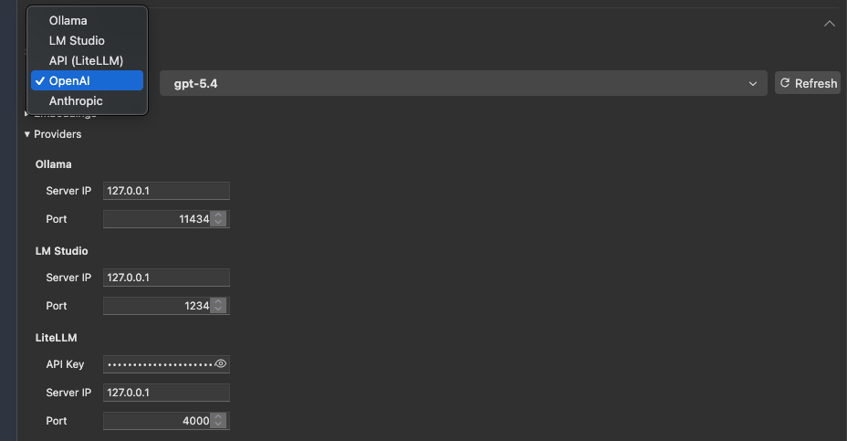
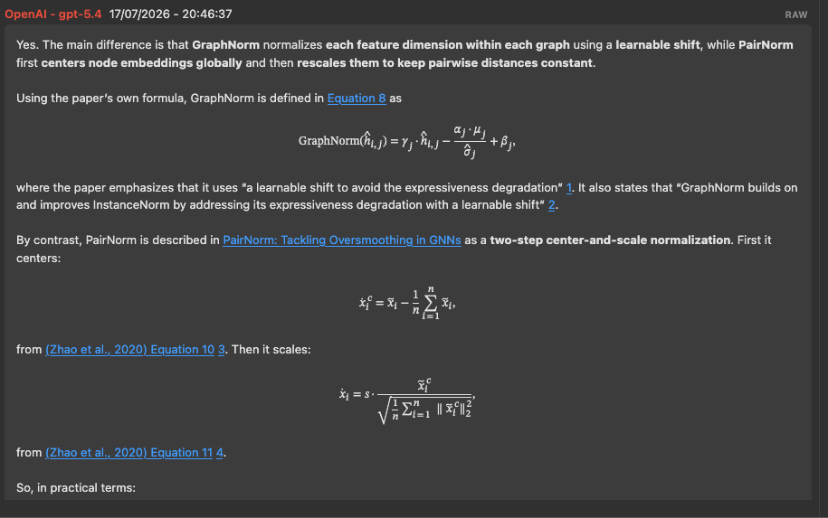
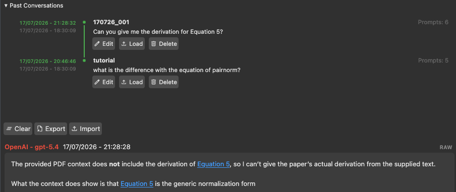
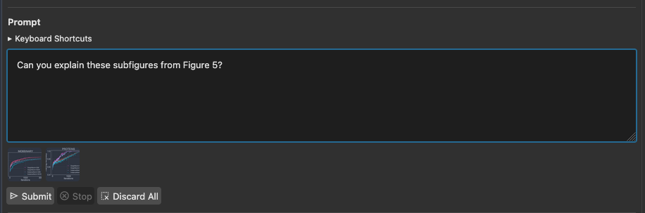
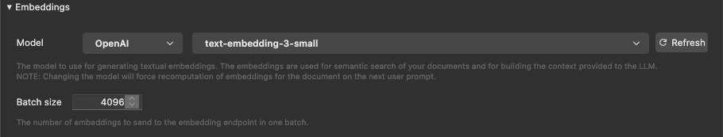
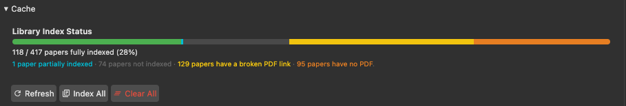

<p align="center">
  
</p>

<p align="center">
  Chat with any PDF open in Zotero's reader, grounded in the paper's own tables, figures, equations, notes, and bibliography.
</p>

---

**LLMz** *(pronounced "el-el-em-zee", /ˌɛlˌɛlˌɛmˈziː/)* is an experimental Zotero 9 item-pane plugin that turns your Zotero into a research assistant by adding an LLM chat pane next to the reader. Ask a question about the paper you're reading and it automatically pulls in whichever paragraphs, tables, figures, equations, your own highlights/notes, and bibliography entries are actually relevant, then answers with clickable citations that jump straight to the right spot in the PDF.

## Features

- 🤝 **Multi-provider** — Ollama, LM Studio, and LiteLLM for local/self-hosted models, plus OpenAI and Anthropic directly. Switch providers and models at any time; vision support is detected per model. Additional model providers can be provided through a LiteLLM proxy.<p      align="center">
  
</p>

- 📄 **PDF-grounded chat + clickable citations** —  Text, tables, figures, equations, your own annotations, and the paper's bibliography are extracted automatically and offered to the model as context, with a single tool-calling round-trip deciding what's actually relevant to your question. The model's answer links back to text excerpts, tables, equations, notes, and page numbers; clicking one jumps the reader to that exact spot.<p 
align="center">
  
</p>

- ⏱️ **Conversation history** — every chat can be saved as markdown per PDF, browsable, exportable, and importable, allowing you to export conversations for sharing with colleagus, Obsidian, or for resuming conversations later.<p      align="center">
  
</p>

- 🏞️ **Image paste** — attach a screenshot or clipping directly into a chat turn.<p      align="center">
  
</p>

- 🎹 **Keyboard-driven** — shortcuts for submit, stop, and history navigation (see the in-pane "Keyboard Shortcuts" panel).

- 📚 **Reference tools** — ask in plain language to download a bibliography entry into your library (with a PDF attached when one can be found), or link it to an item you already have.

- ⬇️ **Table export** — pull one, several, or all of a paper's tables out as CSV files bundled into a zip, image-grounded when the model supports vision.

## Usage

Just type a question about the paper in the **`Prompt`** chat box. Depending on what you ask, LLMz will:

- Pull in matching paragraphs, tables, figures, equations, notes, and/or the bibliography as context before answering.
- Recognize a request to **download** or **link** a specific reference (*"download reference 12 into my library"*, *"link everything by Smith to my library"*).
- Recognize a request to **export tables** (*"export table 3 as CSV"*, *"export all tables"*).

Click any text / table / figure / equation / reference / page-number link in a response to jump to that spot in the reader. Use the `Export` button to save the active conversation for later or to share it with colleagues, to store it in your Obsidian vault or to store it for future LLM ingestion. Click `Load` to resume a past conversation from this paper's conversation history, or `Import` to load any conversation shared as `.md` file.

## Requirements

- Zotero 9.
- A running LLM backend [Ollama](https://ollama.com) or [LM Studio](https://lmstudio.ai) locally, a [LiteLLM](https://www.litellm.ai) proxy, or an OpenAI/Anthropic API key.
- Node.js, for the bundled document-structure pipeline (`sdt/document-worker/`) used to extract equations, references, and notes. Its own runtime dependencies are installed locally (once) via npm:
  ```bash
  cd sdt/document-worker
  npm install
  ```
  `npm install` resolves the correct native binary for your platform automatically (macOS/Windows/Linux, x64/arm64) -- no manual steps needed beyond running it.
- A Python 3 virtual environment at `$ZOTERO_HOME/LLMz/venv`, used to extract and crop figures using `pymupdf`, and to communiate with the `sqlite-vec` embeddings database, with dependencies specified in [`requirements.txt`](requirements.txt):
  ```bash
  python3 -m venv ~/Zotero/LLMz/venv
  ~/Zotero/LLMz/venv/bin/pip install -r requirements.txt
  ```

## Installation

1. Download the latest `llmz.xpi`, or build one yourself from source:
   ```bash
   mkdir build
   zip -r build/llmz.xpi . -x ".*" -x "*.xpi" -x "scripts/__pycache__/*"
   ```
2. In Zotero, go to **Tools → Add-ons**, click the gear icon, choose **Install Add-on From File...**, and select the `.xpi`.
3. Restart Zotero.

## Setup

1. Open **`Preferences` → `LLMz`** (or the pane's own **`Providers`** panel) and pick a provider.
   - For a local server (Ollama/LM Studio/LiteLLM), set its host/port if it isn't running on the default.
   - For OpenAI/Anthropic, enter an API key.
2. Open **`Embeddings`** and select the provider and embedding model that you want to use. ⚠️ **Ideally, this will only be done ONCE.** Every time you switch the embedding model, you will still be able to answer questions about the active PDF, but you will have to re-index your library to support cross-library references. <p
  align="center">
  
</p>

3. Open a PDF in the reader — the LLMz pane appears in the item pane alongside it.
4. Pick a model from the dropdown and start asking questions.

5. To support cross-library citations, open up the **`Library Index`** panel and click on the **`Index All`** button to mine and index all PDF documents in your library. Depending on the embeddings provider and the number of papers in your library, this could take a while. <p
  align="center">
  
</p>

Recommended settings: 
The plugin has been mostly tested with **OpenAI GPT 5.4** as chat model, and using **OpenAI text-embedding-3-small** as embeddings model, ensuring high response and retrieval quality at an acceptable cost.

## How it works

When you open a PDF, LLMz runs it through [`structured-document-text`](https://github.com/zotero/structured-document-text), which classifies the page layout and returns the document's structure -- paragraphs, tables, figures, equations, and bibliography entries, each anchored to a location in the PDF. [`pymupdf`](https://pymupdf.readthedocs.io/) is then used to render pages and crop out the figures and tables identified by that structure. Together these give the model a set of addressable, citable chunks instead of a flat text dump. When you ask a question, a single tool-calling round-trip lets the model pull in whichever chunks are actually relevant, and its answer links back to them so you can jump straight to that spot in the reader.

Alongside this structural extraction, LLMz embeds every paragraph, table, figure, and equation into a [`sqlite-vec`](https://github.com/asg017/sqlite-vec) vector database. These embeddings serve two purposes: they're used to re-ground a citation when the chat model's own reference to a location can't be resolved directly, and, since embeddings are built up across the whole library rather than just the active PDF, they let LLMz pull in relevant paragraphs, equations, figures, and tables from other papers whenever the active document doesn't contain enough context to answer a question on its own.

Navigating to a citation, and gathering context about what you're currently looking at (the active page, a text selection, an annotation), both go through Zotero's own reader API rather than a separate PDF viewer layer. That's what lets a clicked citation jump the actual reader to the right spot, and lets a question implicitly refer to "this page" or "what I've selected" and have LLMz resolve it correctly.

## Project structure

```
llmz/
├── core/                  Plugin logic
│   ├── document/          PDF content extraction: tables, figures, equations, references, notes
│   ├── ui/                Chat pane UI components (chat log, provider settings, history, etc.)
│   ├── llm/               Logic for prompt composition, embedding generation, and for talking to
│   │                      the model endpoints.
│   ├── chat-pane.js       Main plugin entry point (item pane registration, onRender)
│   ├── citation.js        Citation-index building and grounding logic
│   ├── conversation-history.js, semantic-history.js
│   │                      Per-PDF chat history, saved as markdown and semantically searchable
│   ├── import.js, export.js
│   │                      Reference download/link and table export orchestration
│   └── python-setup.js    Bootstraps the venv used for figure extraction
├── tools/                 Native tool-calling features: reference download/link, table export
├── res/
│   ├── icons/             SVG icons
│   └── img/               LLMz logo and README screenshots
├── styles/                Pane stylesheet
├── sdt/document-worker/   The ML-based PDF layout classification pipeline
└── scripts/               Python/Node extraction scripts used to mine the PDF document
```

## Contributing

Feel free to get in touch if you want to contribute to this project, or to open a PR if there is something you would like to see included.

## License

[MIT](LICENSE) © 2026 Luis Herrmann

Note: `pymupdf`, a runtime dependency used for rendering and figure extraction (see [Requirements](#requirements)), is dual-licensed AGPL-3.0 / commercial by Artifex and is not bundled with LLMz -- it's installed separately into your own virtual environment. This doesn't affect LLMz's own MIT license, but it's worth being aware of if you plan to redistribute a packaged install or use LLMz commercially.
